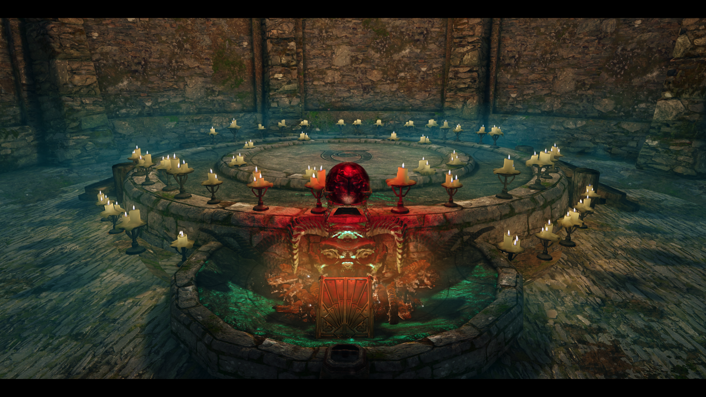
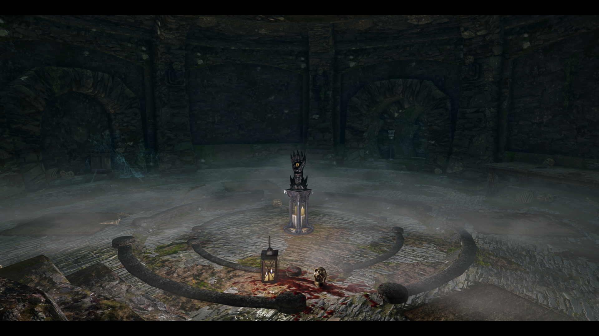
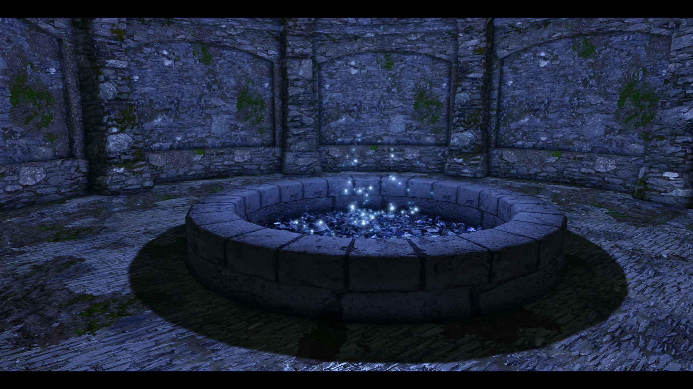
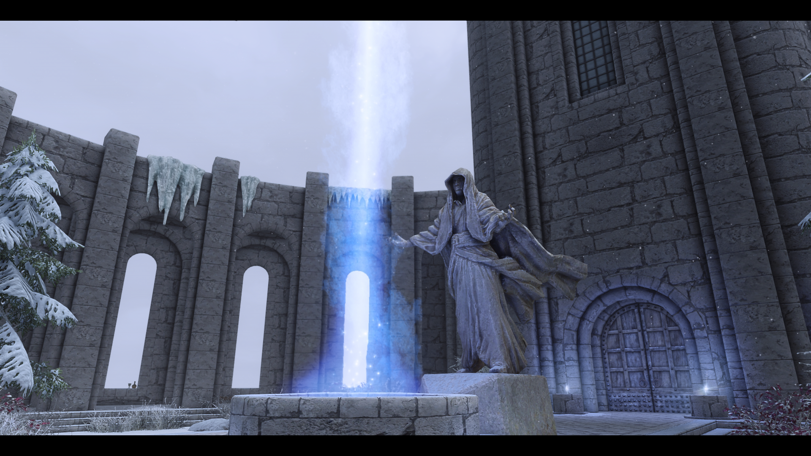

# Oblivion   [![Badge Kofi]][Kofi]

*An **[Mysticism]** addon that overhauls **Atronach Forges**.*

 

## Features

-   Many new & useful recipes as well as exclusive  
    spells made to fit for conjurer characters.

-   Adjusts the required ingredients, to be  
    more sensible with summoned items.

-   Using forges will grant you a small  
    amount of Conjuration experience.

-   Recipes are likely to be found from Urags.

-   Recipes can be more frequently found in loot.

 
 

    

    

 

<!---------------------------------------------------------------->

[Mysticism]: https://github.com/simonmagus616/mysticism
[Kofi]: https://ko-fi.com/V7V54B3PC

<!--------------------------[ Images ]---------------------------->

[Preview A]: Resources/A.png
[Preview B]: Resources/B.png
[Preview C]: Resources/C.png
[Preview D]: Resources/D.png
[Preview E]: ResourcesE.png

<!--------------------------[ Badges ]---------------------------->

[Badge Kofi]: Resources/Kofi.svg